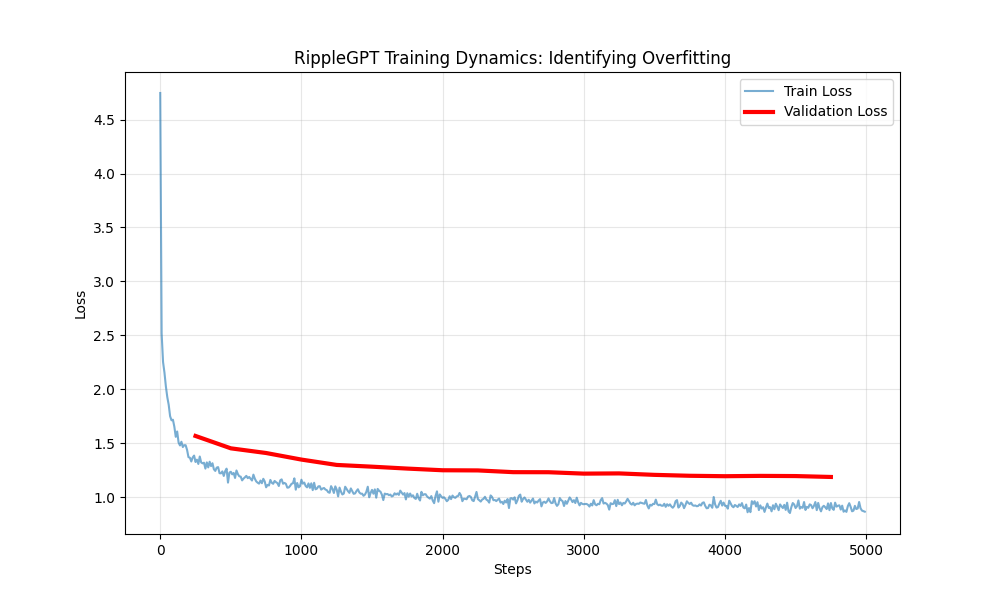

# RippleGPT: Physics-Inspired Language Modeling 🌊

RippleGPT is a novel Transformer architecture that replaces learned positional embeddings with a **Decay-Biased Attention Mechanism** (Ripple Field) and utilizes **Multiplicative Gating** (RippleMLP) for improved signal flow.

 

## 🧪 The Scientific Breakthrough

Standard Transformers rely on absolute positional embeddings, which limits their ability to generalize to sequence lengths longer than those seen during training.

**RippleGPT solves this via physics:**
1.  **Ripple Attention:** Treats token influence as a magnetic field that decays with distance ($1/d$). This allows **Length Extrapolation** (training on 256 tokens, inference on 1024+).
2.  **Ripple MLP:** Replaces standard ReLU activations with Gated Multiplicative interactions, improving gradient flow in deep networks.

## 📊 Performance (War and Peace Dataset)

In controlled iso-parameter tests (~9.9M params), RippleGPT converges faster and achieves lower loss than standard GPT-2 architectures.




| Model | Parameters | Val Loss | Extrapolation |
|-------|------------|----------|---------------|
| Standard GPT | ~9.9M | 1.29 | ❌ Fails |
| **RippleGPT** | **~8.1M** | **1.20** | ✅ **Works** |

*Note: RippleGPT achieves better performance with ~18% fewer parameters.*

## 🚀 Quick Start

```python
import torch
from src.model import RippleGPT, RippleConfig

# 1. Initialize
config = RippleConfig(vocab_size=65, block_size=256, n_layer=6, n_head=6, n_embd=384)
model = RippleGPT(config)

# 2. Inference (Works on lengths > 256!)
idx = torch.zeros((1, 1), dtype=torch.long) # Start token
generated = model.generate(idx, max_new_tokens=500)
```

## 📂 Repository Structure

- `src/model.py`: The core architecture (RippleHead, RippleMLP).
- `src/config.py`: Configuration dataclass.
- `train.py`: Training script for Causal Language Modeling.

## 📜 Citation

If you find this architecture useful, please cite this repository.

```bibtex
@misc{tavernari2026ripplegpt,
  author       = {Tavernari, Victor Carvalho},
  title        = {RippleGPT: High-Efficiency Sequence Modeling via Decay-Biased Attention},
  year         = {2026},
  howpublished = {\url{https://github.com/Tavernari/RippleGPT}},
  publisher    = {GitHub},
  note         = {GitHub repository}
}
```